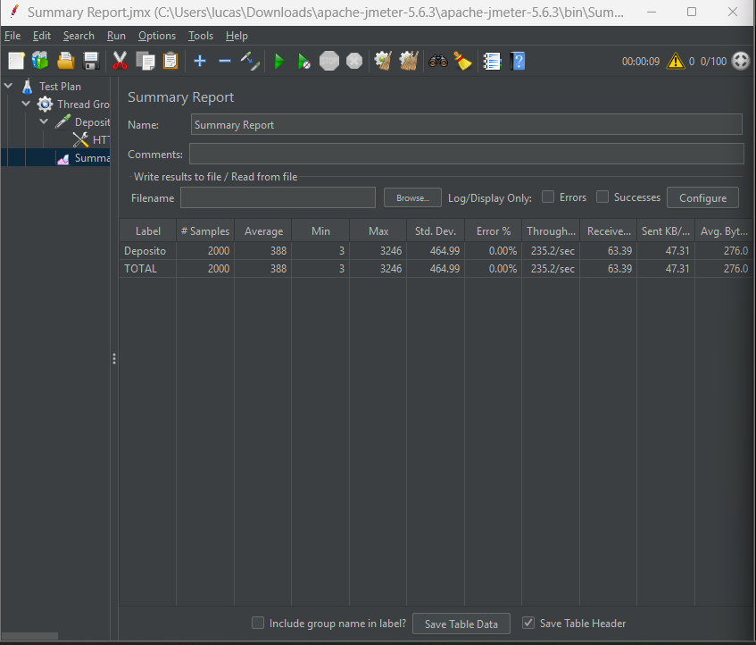
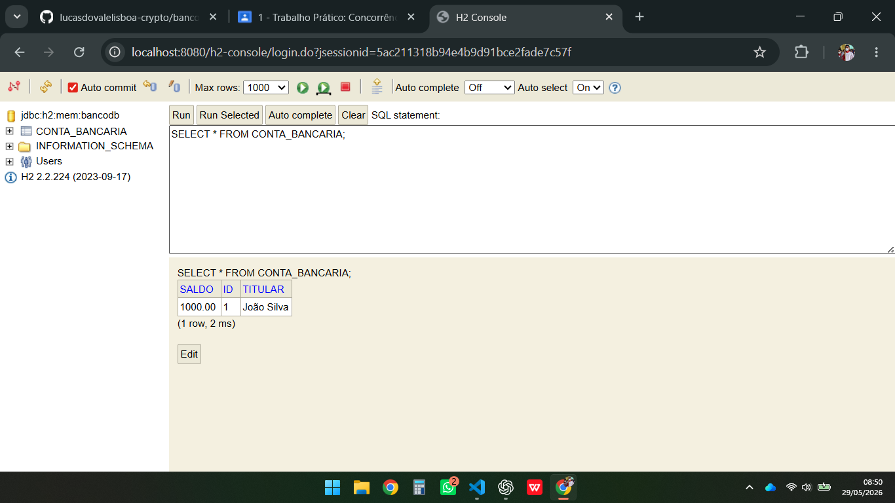
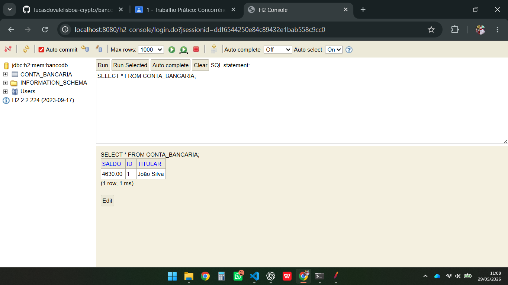
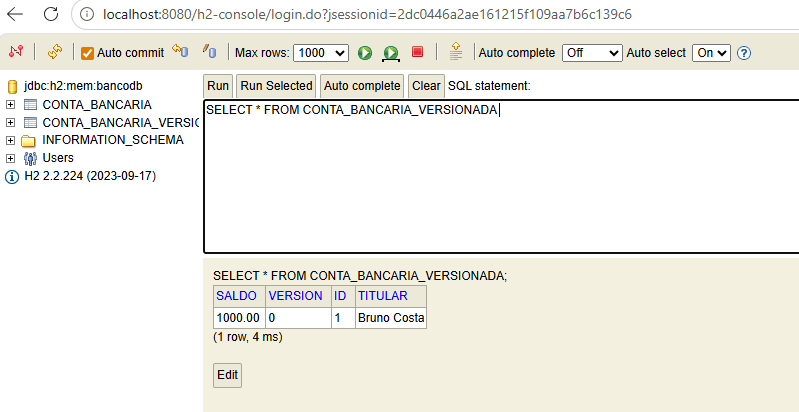
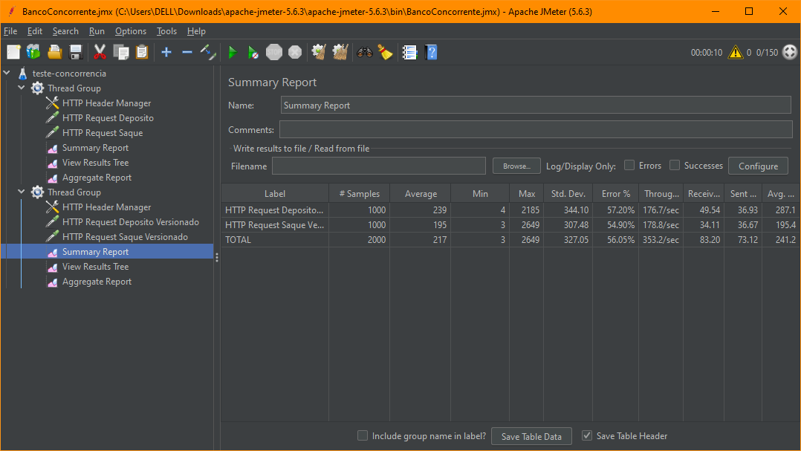
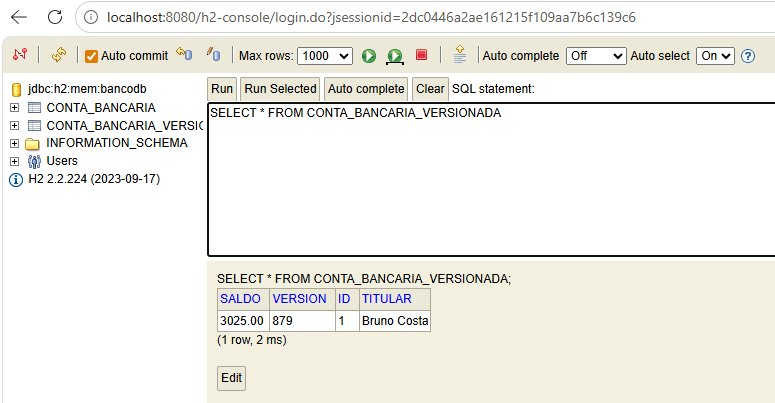

# Banco Concorrência - Spring Boot

## Integrantes da dupla

* Lucas do Vale Lisboa → Parte 1 (Sem controle de concorrência)
* Leonei Maciel Cardoso Júnior → Parte 2 (Controle de concorrência com @Version)

---

# Objetivo

Demonstrar na prática problemas de concorrência em sistemas transacionais utilizando Spring Boot, JPA/Hibernate e banco H2.

O projeto apresenta dois cenários:

* Parte 1 → sistema sem controle de concorrência
* Parte 2 → sistema utilizando controle otimista com `@Version`

---

# Tecnologias utilizadas

* Java 21
* Spring Boot 3.3.5
* Spring Data JPA
* H2 Database
* Maven
* Apache JMeter

---

# Como executar o projeto

## 1. Clonar o repositório

```bash
git clone https://github.com/lucasdovalelisboa-crypto/banco-concorrencia.git
```

---

## 2. Entrar na pasta do projeto

```bash
cd banco-concorrencia
```

---

## 3. Executar a aplicação

```bash
mvn spring-boot:run
```

---

# Console H2

Acessar:

```text
http://localhost:8080/h2-console
```

Configuração:

| Campo     | Valor               |
| --------- | ------------------- |
| JDBC URL  | jdbc:h2:mem:bancodb |
| User Name | sa                  |
| Password  | (vazio)             |

---

# Endpoints

## Buscar conta

```http
GET /contas/{id}
```

---

## Depositar

```http
POST /contas/{id}/deposito
```

Body:

```json
{
  "valor": 10
}
```

---

## Sacar

```http
POST /contas/{id}/saque
```

Body:

```json
{
  "valor": 10
}
```

---

# Parte 1 — Sem Controle de Concorrência

Nesta etapa foi implementada a entidade `ContaBancaria` sem nenhum mecanismo de controle de concorrência, utilizando apenas `@Transactional`.

O objetivo foi demonstrar o problema de:

* Lost Update (Atualização Perdida)
* Inconsistência de saldo
* Sobrescrita de operações simultâneas

---

# Testes com Apache JMeter

Foi criado um cenário de concorrência utilizando múltiplas threads simultâneas.

## Configuração utilizada

| Configuração      | Valor |
| ----------------- | ----- |
| Threads           | 100   |
| Loops             | 20    |
| Valor do depósito | 10    |

---

# Resultado Esperado

Saldo inicial:

```text
1000
```

Saldo esperado após os depósitos concorrentes:

```text
21000
```

---

# Resultado Obtido

Após a execução concorrente no JMeter, o saldo final encontrado foi:

```text
4630
```

---

# Conclusão da Parte 1

O sistema apresentou inconsistência de saldo devido à ausência de controle de concorrência.

Múltiplas threads acessaram e atualizaram o mesmo registro simultaneamente, ocasionando o problema conhecido como Lost Update (Atualização Perdida).

Diversas operações foram sobrescritas durante a execução concorrente, causando diferença significativa entre o saldo esperado e o saldo real armazenado no banco de dados.

---

---

# Evidências dos testes

## Configuração do JMeter



---

## Execução do H2 Inicial



---

## Resultado inconsistente no H2




# Parte 2 — Controle de Versão Otimista

Nesta etapa, foi implementada a entidade `ContaBancariaVersionada`, utilizando a anotação `@Version` (Optimistic Locking) do JPA/Hibernate. O objetivo foi solucionar o problema de Lost Update evidenciado na Parte 1, garantindo a consistência dos dados sob forte concorrência.

#### 1. A Solução e o Tratamento de Erros
Diferente da Parte 1, a nova implementação delega ao framework a verificação da versão da linha no banco de dados. 
* Quando múltiplas threads tentam atualizar o mesmo registro simultaneamente, apenas a primeira transação tem sucesso.
* As demais requisições lançam a exceção `ObjectOptimisticLockingFailureException`.
* O `Controller` captura essa exceção e retorna o status HTTP 409 Conflict, informando que a operação foi barrada devido a um acesso simultâneo.

#### 2. Cenário de Teste Simultâneo (Depósitos e Saques)
Para estressar a validação, foi configurado um novo *Thread Group* no JMeter apontando para os novos endpoints da conta versionada. A configuração utilizada para gerar os acessos simultâneos foi:

| Configuração       | Valor |
| ------------------ | ------ |
| Threads (Usuários) | 100 |
| Loops (Repetições) | 10 |
| Cenário            | Requisições de depósito e saque executadas ao mesmo tempo |

Durante a execução, os seguintes comportamentos foram observados:
* Status 200 (OK): Requisições que conseguiram atualizar o banco sem colidir.
* Status 409 (Conflict): Requisições barradas pelo controle `@Version` para evitar o Lost Update.
* Status 400 (Bad Request): Requisições de saque barradas por "saldo insuficiente".

#### 3. Comprovação da Consistência (Prova Matemática)
Como as requisições conflitantes (409) foram descartadas e não sobrescreveram o saldo, a consistência manteve-se **100% íntegra**. 
A validação foi feita cruzando os dados extraídos do *Summary Report* com os dados gravados no banco.

**Dados da Execução com Sucesso:**
* **Saldo Inicial:** R$ 1.000,00
* **Depósitos (Sucesso):** 428 requisições × R$ 10,00 = R$ 4.280,00
* **Saques (Sucesso):** 451 requisições × R$ 5,00 = R$ 2.255,00
* **Total de Atualizações no Banco:** 428 + 451 = 879 iterações

**Cálculo do Saldo Final:**
> **Saldo Final H2** = Saldo Inicial + (Total Depósitos) - (Total Saques)
> **Saldo Final H2** = 1000 + 4280 - 2255 
> **Saldo Final H2** = **R$ 3.025,00**

O resultado matemático da operação bateu perfeitamente com os valores finais encontrados na tabela `conta_bancaria_versionada` no console do H2 (coluna `saldo` com **3025.00** e coluna `version` com **879**), comprovando o pleno funcionamento do Controle de Versão Otimista.

--------------------------------------------------------------------------------
### Evidências da Parte 2

#### 1. Estado Inicial no Console H2
*(Demonstração do saldo inicial de R$ 1.000,00 e versão zerada antes do teste)*


#### 2. Relatório de Resumo (Summary Report) do JMeter
*(Evidência das 100 threads com 10 loops para saques e depósitos, mostrando a taxa de erros 409/400 que barraram as inconsistências e a exata quantidade de requisições com sucesso)*


#### 3. Comprovação no Console H2 (Após o Teste)
*(Evidência de que o controle @Version funcionou perfeitamente: o saldo final de R$ 3.025,00 e a versão em 879 refletem a matemática exata das transações bem-sucedidas do relatório do JMeter)*



# Arquivos do projeto

* `teste-concorrencia.jmx` → cenário de testes do Apache JMeter
* `README.md` → documentação do projeto
